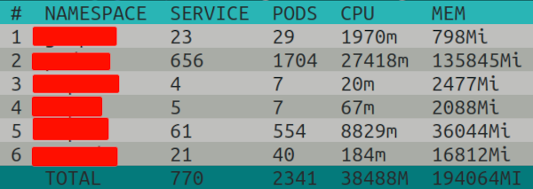
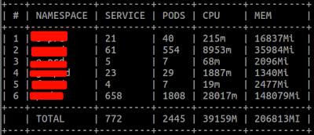

#k8slog

k8slog is a tool for aggregating the values we get when running kubectl get pod -A .

We have a very simple view, but it is just the beginning, we can extend it to different needs we have when we have several nodes and many services and pods in the Kubernetes cluster.

### CONFIG

Here we have only two environment variables

**KUBE_CONFIG** this is your kube config path so we can access your kubernetes cluster
```bash
$ export KUBE_CONFIG=~/.kube/config
```

**SHOW_TABLE** this is whether it will be presented in a table with color or not, only visual presentation of the information
```bash
$ export SHOW_TABLE=true
```
.v

```bash
$ export SHOW_TABLE=false
```
.


### INSTALL
To run k8slog just install it if you have Go, or compile it.
```bash
$ go install github.com/jeffotoni/k8slog@latest
```
